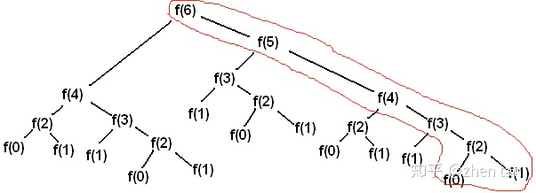
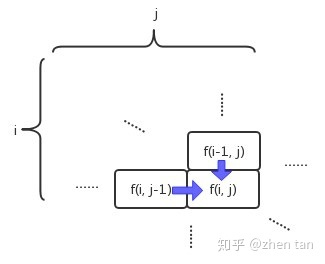

## 动态规划

抄录于 知乎大神关于动态规划的答案  https://www.zhihu.com/question/39948290/answer/883302989

#### 定义

动态规划在寻找有很多重叠子问题的情况的最佳解时有效。它将问题重新组合成子问题。为了避免多次解决这些子问题**，它们的结果都逐渐被计算并被储存，从简单的问题直到整个问题都被解决。因此，动态规划储存递迴时的结果，因而不会在解决同样的问题时花费时间。动态规划只能应用于有最佳子结构的问题。最佳子结构的意思是局部最佳解能决定全域最佳解**（对有些问题这个要求并不能完全满足，故有时需要引入一定的近似）。简单地说，问题能够分解成子问题来解决。

动态规划三要素：问题的阶段,每个阶段的状态以及从前一个阶段转化到后一个阶段之间的递推关系。

#### 适用于‘动态规划’的问题

如果一个问题满足以下两点，那么它就能用动态规划解决。

+ 问题的答案依赖于问题的规模，问题的答案可构成一个数列，规模为自变量，答案为因变量。例如  1个人2条腿、2个人4条腿、....、n个人几条腿？

  即
  $$
  {f(1)、f(2)、f(3)、....、f(n)}  ==> {2、4、6、....、2n}
  $$
  答案构成为一个数列。

+ 大规模问题的答案可以由小规模问题的答案梯推得到，即f(n) 的值可以由{f(i)|i<n}中的个别求得。如上例：
  $$
  f(n) = f(n-1) + 2
  $$
  

+ 

可以用动态规划解决的问题，不代表合适用。如上述数腿的例子可用 
$$
f(n) = 2n
$$
 的显式表达。若有些问题无法用显式表达出来，那么动态规划就适用了。


#### 应用动态规划

当要应用动态规划来解决问题时，归根结底就是想办法完成以下三个关键目标。

+ **建立状态转移方程**

  这一步是最难的，大部分人都被卡在这里。这一步没太多的规律可说，只需抓住一个思维：

  当做已经知道f(1)~f(n-1)的值，然后想办法利用它们求得f(n)。在“数腿”的例子中，状态转移方程即为 
  $$
  f(n) = f(n-1) + 2
  $$
  

+ **缓存并复用以往结果**

  这一步不难，但是很重要。如果没有合适地处理，很有可能就是指数和线性时间复杂度的区别。假设在“数腿”的例子中，我们不能用显式方程，只能用状态转移方程来解。如果现在 f(100) 未知，但是刚刚求解过一次 f(99) 。如果不将其缓存起来，那么求 f(100)时，我们就必须花100次加法运算重新获取。但是如果刚刚缓存过，只需复用这个子结果，那么将只需一次加法运算即可。

+ **按顺序从小往大算**

  这里的“小”和“大”对应的是问题的规模，在这里也就是我们要从 f(1)、f(2)、f(3)、....、f(n)依次顺序计算。这一点在“数腿”的例子来看，似乎显而易见，因为状态方程基本限制了你只能从小到大一步步递推出最终的结果（假设我们仍然不能用显式方程）。然而当问题复杂起来的时候，你有可能乱了套，所以必须记住这也是目标之一。

高中的数列题一般需先推导出状态转移方程，再据此推导出显式表达式（在高中时代称为通项公式）。然而，动态规划是要我们在推导出状态转移方程后，根据状态转移方程用计算机暴力求解出来。显式表达式？在动态规划中是不存在的！

就是因为要暴力计算，所以前面说的目标有两个是涉及到代码层面上：

+ 缓存中间结果：也就是搞个数组之类的变量记录中间结果。
+ 按顺序从小往大算：也就是搞个for循环依次计算。


#### 例题 

1、**斐波那契数列（简单）**

```
斐波那契数列：0, 1, 1, 2, 3, 5, 8, 13, 21, 34, 55, 89, 144, 233……。它遵循这样的规律：当前值为前两个值的和。
```

状态转移工程为
$$
f(n) = f(n-1) + f(n-2)
$$
1.1、使用递归方式

```
   /**
     * 递归方式 O(2^n)
     *
     * @param n
     * @return
     */
    public int recursion(int n) {
        if (n < 2) { // 0、1
            return n;
        }
        return recursion(n - 2) + recursion(n - 1);
    }
```

如上所示，代码简单易懂，然而这代码却极其低效。先不说这种递归的方式造成栈空间的极大浪费，就仅仅是该算法的时间复杂度已经属于 O(2^n) 了。指数级别时间复杂度的算法跟不能用没啥区别。


1.2、使用动态规划

```
    /**
     * 动态规划 O(n)
     *
     * @param n
     * @return
     */
    public int dynamic(int n) {
        int length = n + 1;
        int[] res = new int[length]; // 用于缓存以往结果，以便复用 (目标2)

        for (int i = 0; i < length; i++) { //按顺序从小往大算 (目标3)
            if (i < 2) {
                res[i] = i;
            } else {
                // 使用状态转移方程（目标1），同时复用以往结果（目标2）
                res[i] = res[i - 1] + res[i - 2];
            }
        }

        return res[n];
    }
```

如上代码，针对动态规划的三个子目标，都很好地实现了（参考备注），具体为：

+ 目标1，建立状态转移方程（完成）。也就是前面的
  $$
  f(n) = f(n-1) + f(n-2)
  $$

+ 目标2，缓存并复用以往结果（完成）。图1的简单递归存在大量的重复任务。在线性规划解法在中，结果缓存到 res[] 数组中，同是在 res[i] = res[i - 1] + res[i - 2]; 进行复用。这相当于我们只需完成图2中红色部分的计算任务即可，时间复杂度瞬间降为 O(n)。

  

+ 目标3，按顺序从小往大算（完成）。for循环实现了从0到 n 的顺序求解，让问题按着从小规模往大规模求解的顺序走。


2、**Leetcode P62 不同路径(中等)**

一个机器人位于一个 m x n 网格的左上角 （起始点在下图中标记为 “Start” ）。

机器人每次只能向下或者向右移动一步。机器人试图达到网格的右下角（在下图中标记为 “Finish” ）。

问总共有多少条不同的路径？


解这题，如前所述，我们需要完成三个子目标

+ 建立状态转移方程，如图3所示，第 i 行第 j 列的格子的路径数，是等于它左边格子和上面格子的路径数之和：
  $$
  f(i,j) = f(i-1, j) + f(i, j-1); 
  f(0,0) = 1
  $$
  

+ 缓存并复用以往结果。与之前说的一维数列不同，这里的中间结果可以构成一个二维数列,所以需要用二维的数组或者列表来存储。

+ 按顺序从小往大算。这次有两个维度，所以需两个循环，分别逐行和逐列让问题从小规模到大规模计算。

```
    /**
     * 动态规划
     *
     * @param m
     * @param n
     * @return
     */
    public int uniquePaths(int m, int n) {

        // 将二维列表后用于缓存（目标2）
        int[][] res = new int[m][n];

        /**
         * 注：从【0,0】 先右走边界；或向下走边界 都只有一条路
         */
        for (int i = 0; i < m; i++) { // 向下走，遍历行
            res[i][0] = 1;
        }
        for (int j = 0; j < n; j++) { // 向右走，遍历列
            res[0][j] = 1;
        }

        /**
         * [0,0] 已初始化为 1； 避免 i-1 与 j-1 则循环从 1 开始
         */
        for (int i = 1; i < m; i++) { // 外循环逐行计算（目标3）
            for (int j = 1; j < n; j++) { // 外循环逐行计算（目标3）
                // 状态方程（目标1），以及中间结果复用（目标2）
                res[i][j] = res[i - 1][j] + res[i][j - 1];
            }
        }

        return res[m - 1][n - 1]; // 从 [0,0] 走到 [m-1,n-1]
    }
```

3、**正则表达式匹配（地狱）**

未看懂，待录


#### **总结**

动态规划与其说是一个算法，不如说是一种方法论。该方法论主要致力于将**合适**的问题拆分成三个子目标一一击破：

+ 建立状态转移方程
+ 缓存并复用以往结果
+ 按顺序从小往大算

